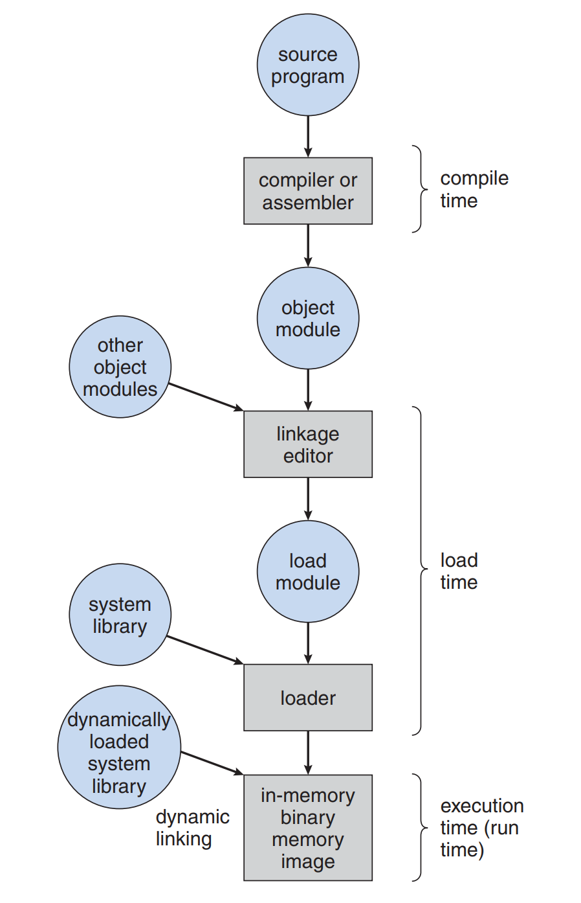
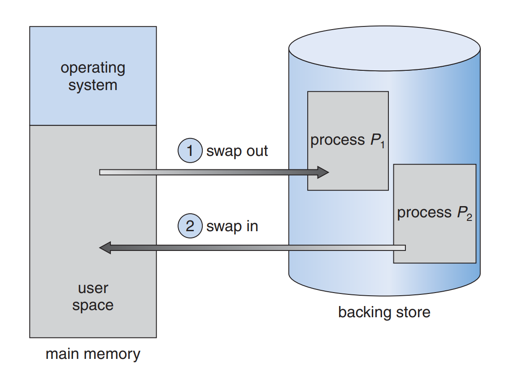
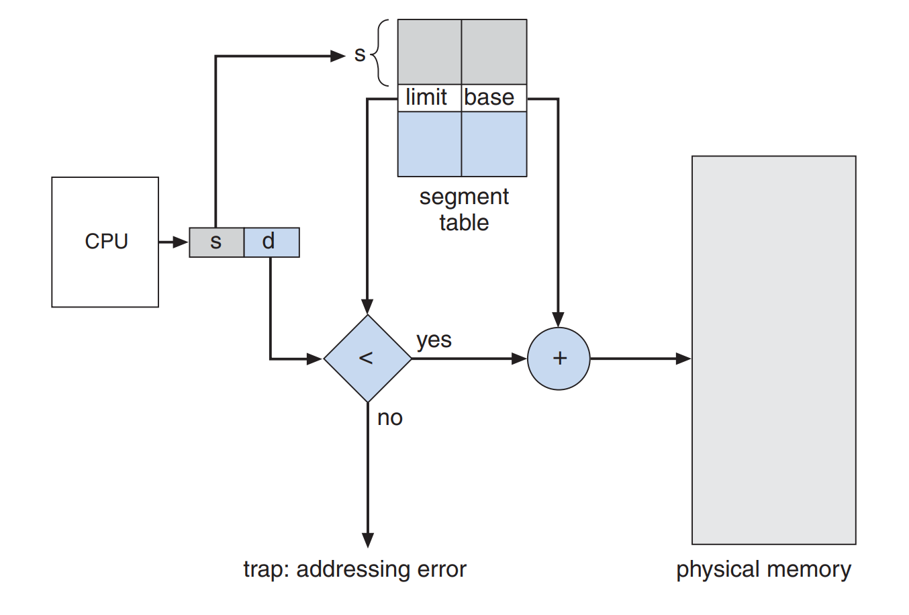
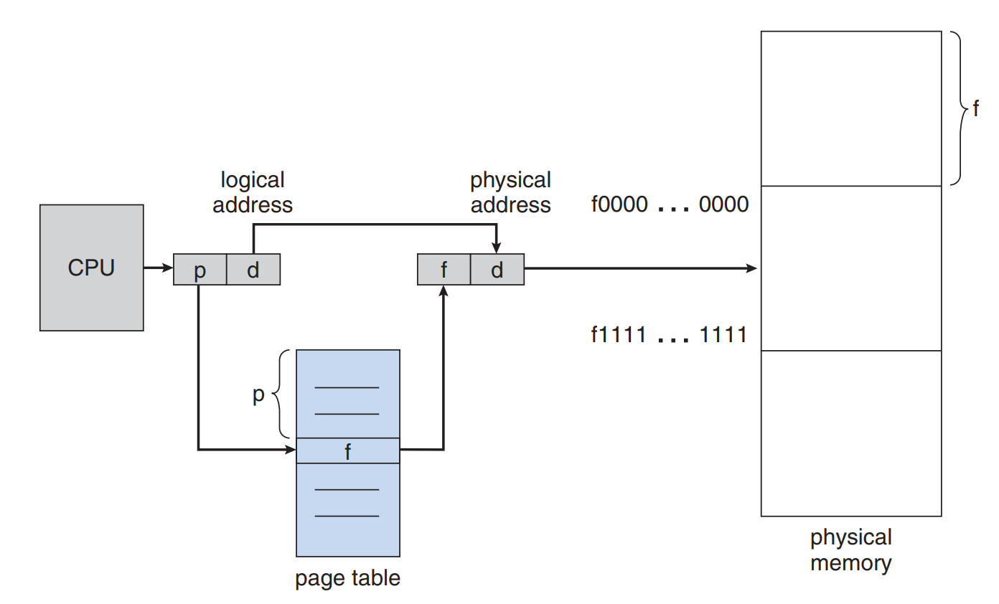

# Memory

Memory is central to the operation of a modern computer system. Memory consists of a large array of bytes, each with its own address. The CPU fetches instructions from memory according to the value of the program counter. These instructions may cause additional loading from and storing to specific memory addresses.

## Basic Hardware

Main memory and the registers built into the processor itself are the only general-purpose storage that the CPU can access directly. **There are machine instructions that take memory addresses as arguments, but none that take disk addresses**. Therefore, any instructions in execution, and any data being used by the instructions, must be in one of these direct-access storage devices. If the data are not in memory, they must be moved there before the CPU can operate on them.

## Address Binding

## Swapping

A process must be in memory to be executed. A process, however, can be swapped temporarily out of memory to a backing store and then brought back into memory for continued execution. Swapping makes it possible for the total physical address space of all processes to exceed the real physical memory of the system, thus increasing the degree of multiprogramming in a
system.

## Memory Allocation Mechanism - Contiguous Memory Allocation

In general, the memory blocks available comprise a set of holes (blocks of free memory) of various sizes scattered throughout memory. When a process arrives and needs memory, the system searches the set for a hole that is large enough for this process. If the hole is too large, it is split into two parts. One part is allocated to the arriving process; the other is returned to the set of holes. When a process terminates, it releases its block of memory, which is then placed back in the set of holes. If the new hole is adjacent to other holes, these adjacent holes are merged to form one larger hole. At this point, the system may need to check whether there are processes waiting for memory and whether this newly freed and recombined memory could satisfy the demands of any of these waiting processes.

This mechanism can lead to fragmentation:

- Internal fragmentation: The memory block allocated to process is bigger than the amount of memory which the process uses.  
- External fragmentation: The sum of hole is enough for process but they are not contiguous thus they are still unusable.

## Memory Allocation Mechanism - Segmentation

A memory-management scheme that creates address spaces of various sizes, called segments. A logical address space is a collection of segments. Each segment has a name and a length. The addresses specify both the segment name and the offset within the segment. The programmer therefore specifies each address by two quantities: a segment name and an offset.

Normally, when a program is compiled, the compiler automatically constructs segments reflecting the input program. A C compiler might create separate segments for the following:

- The code
- Global variables
- The heap, from which memory is allocated
- The stacks used by each thread
- Then standard C librabry

### Segmentation Hardware

Although the programmer can now refer to objects in the program by a two-dimensional address (segment name and offset), the actual physical memory is still, of course, a onedimensional sequence of bytes. Thus, we must define an implementation to map two-dimensional programmer-defined addresses into one-dimensional physical addresses. This mapping is effected by a segment table. Each entry in the segment table has a segment base and a segment limit. The segment base contains the starting physical address where the segment resides in memory, and the segment limit specifies the length of the segment.

Segmentation can lead to external fragmentation. [Why?](https://www.quora.com/How-external-fragmentation-is-possible-in-memory-management-using-Segmentation-scheme-in-OS)

## Memory Allocation Mechanism - Paging

Segmentation permits the physical address space of a process to be noncontiguous. Paging is another memory-management scheme that offers this advantage. However, paging avoids external fragmentation and the need for compaction, whereas segmentation does not. It also solves the considerable problem of fitting memory chunks of varying sizes onto the backing store. Most memory-management schemes used before the introduction of paging suffered from this problem. The problem arises because, when code fragments or data residing in main memory need to be swapped out, space must be found on the backing store. The backing store has the same fragmentation problems discussed in connection with main memory, but access is much slower, so compaction is impossible.

## Basic Method

The basic method for implementing paging involves breaking physical memory into fixed-sized blocks called frames and breaking logical memory into blocks of the same size called pages. When a process is to be executed, its pages are loaded into any available memory frames from their source (a file system or the backing store). The backing store is divided into fixed-sized blocks that are the same size as the memory frames or clusters of multiple frames. This rather simple idea has great functionality and wide ramifications. For example, the logical address space is now totally separate from the physical address space, so a process can have a logical 64-bit address space even though the system has less than 264 bytes of physical memory.

Every address generated by the CPU is divided into two parts: a page number (p) and a page offset (d). The page number is used as an index into a page table. The page table contains the base address of each page in physical memory. This base address is combined with the page offset to define the physical memory address that is sent to the memory unit.

## Memory Allocation Mechanism - Segmentation Paging

Some modern computers use a function called segmented paging. Main memory is divided into variably-sized segments, which are then divided into smaller fixed-size pages on disk. Each segment contains a page table, and there are multiple page tables per process.

Each of the tables contains information on every segment page, while the segment table has information about every segment. Segment tables are mapped to page tables, and page tables are mapped to individual pages within a segment.

Advantages include less memory usage, more flexibility on page sizes, simplified memory allocation, and an additional level of data access security over paging. The process does not cause external fragmentation.

## Memory Allocation Mechanism - Advantages and Disadvantages

|              | Advantage                                                                                                                                                                                                                                                                                                                                                            | Disadvantage                                                                                                   |
|--------------|----------------------------------------------------------------------------------------------------------------------------------------------------------------------------------------------------------------------------------------------------------------------------------------------------------------------------------------------------------------------|----------------------------------------------------------------------------------------------------------------|
| Paging       | - Transparent to programmer and no intervention required   - No external fragmentation   - No internal fragmentation in modern OS   - Frame does not need to be contiguous                                                                                                                                                                           | - Internal fragmentation occurs in old OS   - Longer memory lookup times than segmentation (solved by TLB) |
| Segmentation | - Consumes less space compared to page tables   - Average segment sizes are larger than most page sizes, which allows segments to store more process data   - Less processing overhead   - Simpler to relocate segments than to relocate contiguous address spaces on disk   - Segment tables are smaller than page tables, and takes up less memory | - Subject to serious external fragmentation   - Requires programmer intervention                           |