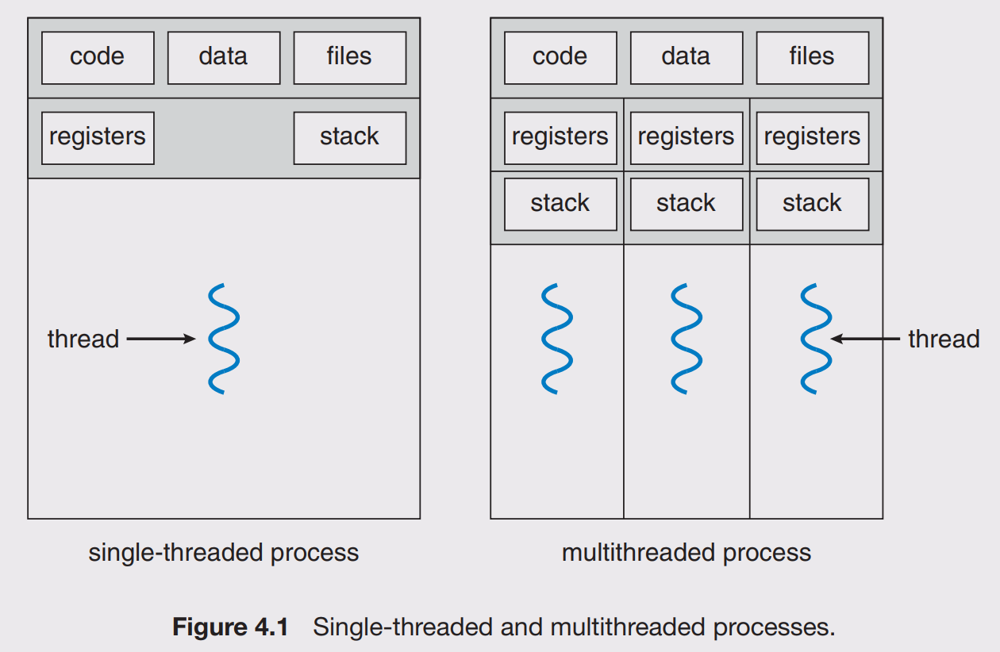

# Thread

## Composition

- Register set: a set of register state
- Program counter: pointer to next instruction to be executed
- Stack: contains temporary data (such as function parameters, return address and local variables)
- Text, heap, data section are shared accross thread of the same process

## Structure

## Model

- Many to One: N user threads are multiplexed to 1 kernel thread
- One to One: 1 user thread is multiplexed to 1 kernel thread
- Many to Many: N user threads are multiplexed to N kernel thread

In Many to One model, when a user thread making an I/O request, all other threads are also blocked. The reason is that when waiting for I/O, kernel thread is in waiting state and not scheduled any CPU.
