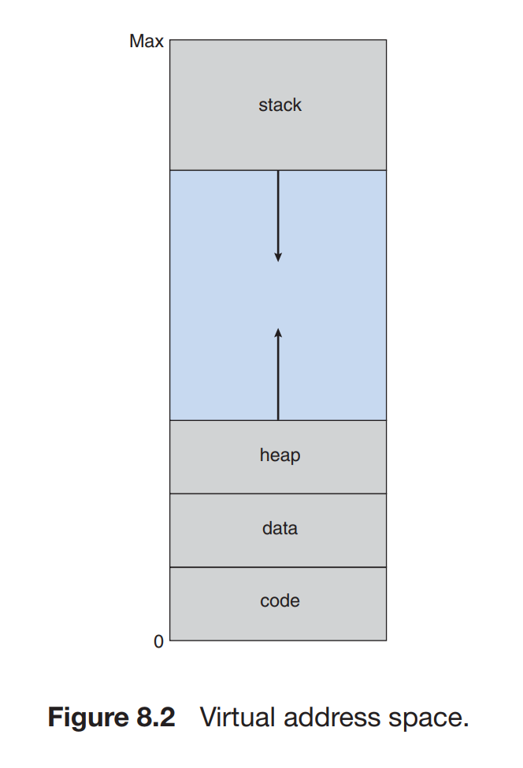

# Virtual Memory

Virtual memory involves the separation of logical memory as perceived by users from physical memory. This separation allows an extremely large virtual memory to be provided for programmers when only a smaller physical memory is available (Figure 8.1). Virtual memory makes the task of programming much easier, because the programmer no longer needs to worry about the amount of physical memory available; she can concentrate instead on the problem to be programmed.

The virtual address space of a process refers to the logical (or virtual) view of how a process is stored in memory. Typically, this view is that a process begins at a certain logical address—say, address 0—and exists in contiguous memory. physical memory may be organized in page frames and that the physical page frames assigned to a process may not be contiguous. It is up to the memorymanagement unit (MMU) to map logical pages to physical page frames in memory.

## Demand Paging

With demand-paged virtual memory, pages are loaded only when they are demanded during program execution. Pages that are never accessed are thus never loaded into physical memory. When we want to execute a process, we swap it into memory. Rather than swapping the entire process into memory, though, we use a lazy swapper. A lazy swapper never swaps a page into memory unless that page will be needed. In the context of a demand-paging system, use of the term “swapper” is technically incorrect. A swapper manipulates entire processes, whereas a pager is concerned with the individual pages of a process. We thus use “pager,” rather than “swapper,” in connection with demand paging.
